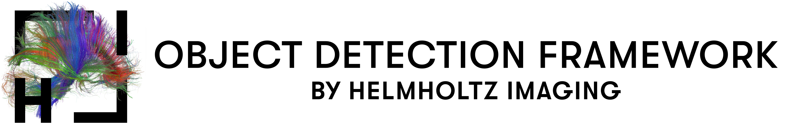

<div align="center">

<p align="left">
  
</p>

Generalized-YOLOv5 is a modified version of YOLOv5.
Two main contributions have been made to Generalized-YOLOv5. First, an extension to train on non-natural images and second a cross-validation extension.

### Non-Natural image extension
The non-natural image extension enables YOLOv5 to handle images with arbitrary intensity scales, so it can be trained on 2D non-natural images.
Furthermore, this extension also includes preprocessing scripts to convert non-natural image datasets to a natural intensity scale.
Training on natural images is faster as OpenCV, which is highly optimized on natural images, can be used during training for preprocessing and augmentation.
However, this can lead in some scenarios to a decreased performance as the intensity scale is often reduced to a fraction of its original scale.
The slow-down on non-natural images can be somewhat mitigated by increasing worker threads (until they block each other), but one should expect an increased training time of 1.5x.

### N-fold cross-validation
The cross-validation extension is a dataset preprocessing script that processes a dataset into N folds with corresponding dataset configuration files that are understood by YOLOv5.
On each fold a YOLOv5 model can be trained and YOLOv5's built-in ensembling method can be used to run inference with the models of all folds.
The built-in ensembling method itself has no cross-validation functionality and was only designed for ad-hoc ensembling of YOLOv5 models of different scales, thus the preprocessing script is required for cross-validation.

## <div align="center">Documentation</div>

See the documentation and usage of the Generalized-YOLOv5 in the [Generalized-YOLOv5 README](evaluations/Node21/README.md).
The official YOLOv5 documentation can be found in the [YOLOv5 README](README_YOLOV5.md).

## <div align="center">Quick Start Examples</div>

<details open>
<summary>Install</summary>

Clone repo and install [requirements_non_natural.txt](https://github.com/MIC-DKFZ/generalized_yolov5/blob/master/requirements.txt) in a
[**Python>=3.7.0**](https://www.python.org/) environment, including
[**PyTorch>=1.7**](https://pytorch.org/get-started/locally/).

```bash
git clone https://github.com/MIC-DKFZ/generalized_yolov5  # clone
cd yolov5
pip install -r requirements_non_natural.txt  # install
```

</details>

<details open>
<summary>Inference</summary>

YOLOv5 [PyTorch Hub](https://github.com/ultralytics/yolov5/issues/36) inference. [Models](https://github.com/ultralytics/yolov5/tree/master/models) download automatically from the latest
YOLOv5 [release](https://github.com/ultralytics/yolov5/releases).

```python
import torch

# Model
model = torch.hub.load('ultralytics/yolov5', 'yolov5s')  # or yolov5n - yolov5x6, custom

# Images
img = 'https://ultralytics.com/images/zidane.jpg'  # or file, Path, PIL, OpenCV, numpy, list

# Inference
results = model(img)

# Results
results.print()  # or .show(), .save(), .crop(), .pandas(), etc.
```

</details>

<details>
<summary>Inference with detect.py</summary>

`detect.py` runs inference on a variety of sources, downloading [models](https://github.com/ultralytics/yolov5/tree/master/models) automatically from
the latest YOLOv5 [release](https://github.com/ultralytics/yolov5/releases) and saving results to `runs/detect`.

```bash
python detect.py --source 0  # webcam
                          img.jpg  # image
                          vid.mp4  # video
                          path/  # directory
                          'path/*.jpg'  # glob
                          'https://youtu.be/Zgi9g1ksQHc'  # YouTube
                          'rtsp://example.com/media.mp4'  # RTSP, RTMP, HTTP stream
```

</details>

<details>
<summary>Training</summary>

The commands below reproduce YOLOv5 [COCO](https://github.com/ultralytics/yolov5/blob/master/data/scripts/get_coco.sh)
results. [Models](https://github.com/ultralytics/yolov5/tree/master/models)
and [datasets](https://github.com/ultralytics/yolov5/tree/master/data) download automatically from the latest
YOLOv5 [release](https://github.com/ultralytics/yolov5/releases). Training times for YOLOv5n/s/m/l/x are
1/2/4/6/8 days on a V100 GPU ([Multi-GPU](https://github.com/ultralytics/yolov5/issues/475) times faster). Use the
largest `--batch-size` possible, or pass `--batch-size -1` for
YOLOv5 [AutoBatch](https://github.com/ultralytics/yolov5/pull/5092). Batch sizes shown for V100-16GB.

```bash
python train.py --data coco.yaml --cfg yolov5n.yaml --weights '' --batch-size 128
                                       yolov5s                                64
                                       yolov5m                                40
                                       yolov5l                                24
                                       yolov5x                                16
```


</details>

<div align="left">
<details open>
<summary >Tutorials</summary>

- [Train Custom Data](https://github.com/ultralytics/yolov5/wiki/Train-Custom-Data)  🚀 RECOMMENDED
- [Tips for Best Training Results](https://github.com/ultralytics/yolov5/wiki/Tips-for-Best-Training-Results)  ☘️
  RECOMMENDED
- [Multi-GPU Training](https://github.com/ultralytics/yolov5/issues/475)
- [PyTorch Hub](https://github.com/ultralytics/yolov5/issues/36) 🌟 NEW
- [TFLite, ONNX, CoreML, TensorRT Export](https://github.com/ultralytics/yolov5/issues/251) 🚀
- [Test-Time Augmentation (TTA)](https://github.com/ultralytics/yolov5/issues/303)
- [Model Ensembling](https://github.com/ultralytics/yolov5/issues/318)
- [Model Pruning/Sparsity](https://github.com/ultralytics/yolov5/issues/304)
- [Hyperparameter Evolution](https://github.com/ultralytics/yolov5/issues/607)
- [Transfer Learning with Frozen Layers](https://github.com/ultralytics/yolov5/issues/1314)
- [Architecture Summary](https://github.com/ultralytics/yolov5/issues/6998) 🌟 NEW
- [Weights & Biases Logging](https://github.com/ultralytics/yolov5/issues/1289)
- [Roboflow for Datasets, Labeling, and Active Learning](https://github.com/ultralytics/yolov5/issues/4975)  🌟 NEW
- [ClearML Logging](https://github.com/ultralytics/yolov5/tree/master/utils/loggers/clearml) 🌟 NEW
- [Deci Platform](https://github.com/ultralytics/yolov5/wiki/Deci-Platform) 🌟 NEW

</details>
</div>

## <div align="center">Contact</div>

For Generalized-YOLOv5 bugs and feature requests please visit [GitHub Issues](https://github.com/MIC-DKFZ/generalized_yolov5/issues). For business inquiries or
professional support requests please visit [https://helmholtz-imaging.de/contact](https://helmholtz-imaging.de/contact/index_eng.html).

<br>

<br>
<div align="center">
  <a href="https://github.com/MIC-DKFZ/generalized_yolov5" style="text-decoration:none;">
    </a>
  
  <a href="https://twitter.com/helmholtz_image" style="text-decoration:none;">
    </a>
  
  <a href="https://www.instagram.com/helmholtzimaging/" style="text-decoration:none;">
    </a>
</div>
