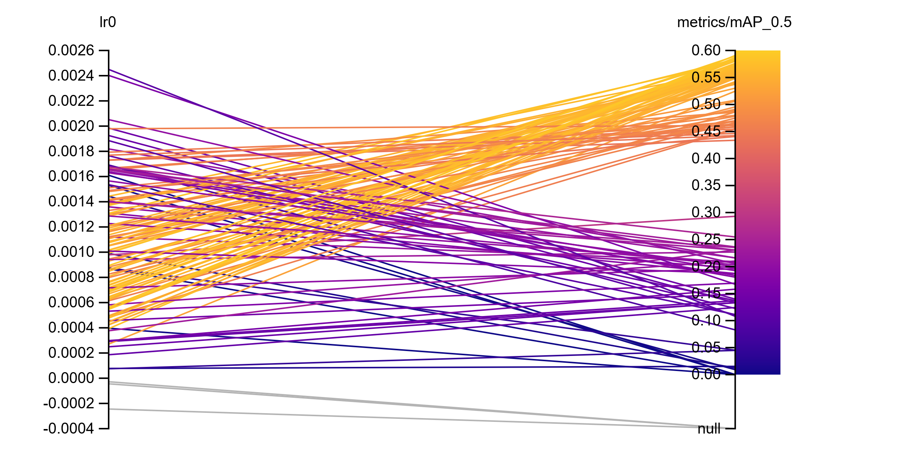
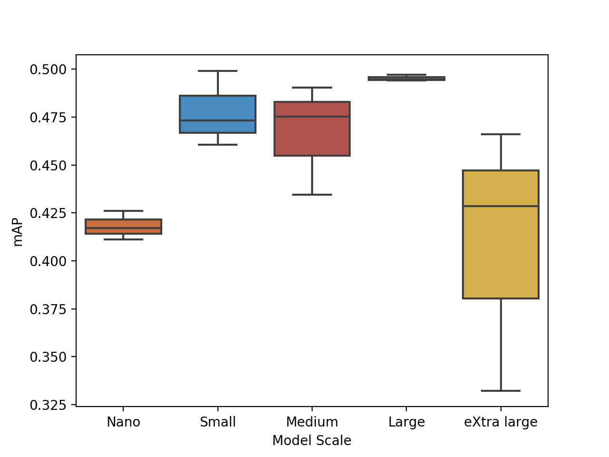

# Experiments on the Node21 dataset with YOLOv5

This repository contains a modified YOLOv5 version that has been evaluated with multiple different settings on the Node21 dataset.
Two main contributions have been made to YOLOv5. First, an extension to train on non-natural images and second a cross-validation extension.

### Non-Natural image extension
The non-natural image extension enables YOLOv5 to handle images with arbitrary intensity scales, so it can be trained on 2D non-natural images.
Furthermore, this extension also includes preprocessing scripts to convert non-natural image datasets to a natural intensity scale.
Training on natural images is faster as OpenCV, which is highly optimized on natural images, can be used during training for preprocessing and augmentation.
However, this can lead in some scenarios to a decreased performance as the intensity scale is often reduced to a fraction of its original scale.
The slow-down on non-natural images can be somewhat mitigated by increasing worker threads (until they block each other), but one should expect an increased training time of 1.5x.

### N-fold cross-validation
The cross-validation extension is a dataset preprocessing script that processes a dataset into N folds with corresponding dataset configuration files that are understood by YOLOv5.
On each fold a YOLOv5 model can be trained and YOLOv5's built-in ensembling method can be used to run inference with the models of all folds.
The built-in ensembling method itself has no cross-validation functionality and was only designed for ad-hoc ensembling of YOLOv5 models of different scales, thus the preprocessing script is required for cross-validation.


## Requirements

Install all requirements for YOLOv5 and the non-natural preprocessing.

1. Go to https://pytorch.org/get-started/locally/ and install pytorch
2. Install requirements: `pip install -r yolov5/requirements_non_natural.txt`

## Dataset preparation

### Dataset download

Join the Node21 challenge on https://node21.grand-challenge.org/ and follow the instructions to download the dataset.

The folder structure should look like this:

```
    .
    ├── original_data
        ├── images
        ├── filenames_orig_and_new.csv
        └── metadata.csv
    └── proccessed_data
        ├── images
        ├── metadata.csv
        └── simulated_metadata.csv
```

### Dataset preprocessing

Next we want to preprocess the dataset and bring it into YOLOv5 format, while keeping the non-natural image intensity scale. Optionally we can convert the dataset into the natural image scale of [0,255] as well.

- Navigate to the detection directory: `cd detection`
- Adjust the parameters `metadata_path`, `img_load_dir`, `save_dir` and `cv_folds` in `evaluations/Node21/dataset_conversion/yolov5_convert_config_non_natural.yaml`
  - `metadata_path`: Absolute path to `metadata.csv `
  - `img_load_dir`: Absolute path to `proccessed_data/images`
  - `save_dir`: Absolute path to the target folder
  - `cv_folds`: Number of folds for the cross-validation
- (Optional): Do the same for `evaluations/Node21/dataset_conversion/yolov5_convert_config_natural.yaml` too
- Preprocess the dataset, while keeping the non-natural image intensity scale: `python yolov5/data/preprocess/dataset_preprocess.py -c evaluations/Node21/dataset_conversion/yolov5_convert_config_non_natural.yaml`
- (Optional): Preprocess the dataset, while converting to natural intensity scale: `python yolov5/data/preprocess/dataset_preprocess.py -c evaluations/Node21/dataset_conversion/yolov5_convert_config_natural.yaml`


## YOLOv5 - Training

Training on the preprocessed Node21 dataset can be started with the train.py. It is important to note that some hyperparameters are set in the run command, while some are set in the hyperparameter configuration file.
The parameters in the hyperparameter configuration file are usually not changed. Hence, only the parameters that change more frequently are used as arguments when starting the training.


Example command:

`python train.py --name experiment_name --data /path/to/data.yaml --hyp data/hyps/hyp.scratch-high.yaml --project /path/to/experiment/folder/ --epochs 500 --img 512 --batch 16 --patience 0 --weights yolov5m.pt`

Relevant arguments:
- name: The name of the experiment.
- data: The absolute or relative path to the dataset YAML.
- hyp: The absolute or relative path to the hyperparameter YAML.
- project: The absolute or relative path to the target experiment/project folder used for saving.
- epochs: The number of training epochs.
- img: The used image size. Images are always resized to the same size, so only one value is required.
- batch: The batch size.
- patience: The patience of how many epochs training should stop without an improvement. Setting this argument to zero disables the patience.
- weights: The pretrained weights that should be used for initialization.

Example hyperparameter configuration file:

```yaml
# YOLOv5 🚀 by Ultralytics, GPL-3.0 license
# Hyperparameters for high-augmentation COCO training from scratch
# python train.py --batch 32 --cfg yolov5m6.yaml --weights '' --data coco.yaml --img 1280 --epochs 300
# See tutorials for hyperparameter evolution https://github.com/ultralytics/yolov5#tutorials

# Model parameters
lr0: 0.01  # initial learning rate (SGD=1E-2, Adam=1E-3)
lrf: 0.2  # final OneCycleLR learning rate (lr0 * lrf)
momentum: 0.937  # SGD momentum/Adam beta1
weight_decay: 0.0005  # optimizer weight decay 5e-4
warmup_epochs: 3.0  # warmup epochs (fractions ok)
warmup_momentum: 0.8  # warmup initial momentum
warmup_bias_lr: 0.1  # warmup initial bias lr

# Loss parameters
box: 0.05  # box loss gain
cls: 0.3  # cls loss gain
cls_pw: 1.0  # cls BCELoss positive_weight
obj: 0.7  # obj loss gain (scale with pixels)
obj_pw: 1.0  # obj BCELoss positive_weight
iou_t: 0.20  # IoU training threshold
anchor_t: 4.0  # anchor-multiple threshold
# anchors: 3  # anchors per output layer (0 to ignore)
fl_gamma: 0.0  # focal loss gamma (efficientDet default gamma=1.5)

# Augmentation parameters
hsv_h: 0.015  # image HSV-Hue augmentation (fraction)
hsv_s: 0.7  # image HSV-Saturation augmentation (fraction)
hsv_v: 0.4  # image HSV-Value augmentation (fraction)
degrees: 0.0  # image rotation (+/- deg)
translate: 0.1  # image translation (+/- fraction)
scale: 0.9  # image scale (+/- gain)
shear: 0.0  # image shear (+/- deg)
perspective: 0.0  # image perspective (+/- fraction), range 0-0.001
flipud: 0.0  # image flip up-down (probability)
fliplr: 0.5  # image flip left-right (probability)
mosaic: 1.0  # image mosaic (probability)
mixup: 0.1  # image mixup (probability)
copy_paste: 0.1  # segment copy-paste (probability)

# Non-natural dataset parameters
standardize: False  # Enable or disable global standardization
img_fill_value: 2298  # mean intensity in entire dataset (for augmentation)
max_value: 4095  # maximum intensity in entire dataset
img_dtype: 'int16'  # required data type to represent the intensity scale (float < int, higher < lower)
mean: 2298 # mean intensity in entire dataset (for standardization)
std: 1029 # standard deviation intensity in entire dataset (for standardization)
channels: 3  # number of image channels (Three is best even if it is just one, due to YOLOv5 optimizations. Channels get scaled automatically to this value)
```

When training in the non-natural intensity scale with enabled standardization then the standardization parameters in the non-natural section of the config should be recomputed on the dataset.
However, the experiments will show that standardization is not required and can be deactivated during training.

In order to optimize the performance of a model if desired, the augmentation parameters are a good starting point.

## Experiments

The following experiments have been performed on the Node21 dataset:
- Learning rate evaluation [here](#learning-rate) 
  - Learning rate hyperparameter search
- Training from scratch vs training from pretrained YOLOv5 weights
- Impact of different model scales
- Impact of different batch sizes
- Impact of different image sizes
- Training with natural intensity scale vs training with non-natural intensity scale
- Standardizing the dataset vs not-standardizing the dataset
- YOLOv5 arch P5 vs P6
- Final configuration evaluation with train/val and 5F-CV training

For each experiment a default configuration has been used with only the parameter of interest changed. This enables us to observe the impact of different configurations.
The default configuration is:
- Learning rate: 0.01
- Model scale: M
- Model pretraining: Pretrained
- Batch size: 16
- Image size: 512x512
- Intensity scale: Natural
- Standardization: Not-Standardized
- Model architecture: P5
- Dataset split: Train/Val

A single model training with natural images and default configuration takes about 8 hours on an NVIDIA GeForce RTX 2080 Ti and has a gpu memory consumption of 6.4 GB. 
When training with non-natural images and otherwise the same setting training takes about 12 hours. Further, we run every configuration/experiment three times.

The number of experiments we can perform for every setting is therefore limited.

### Metrics - mAP@0.5 and mAP@[.5:.95]

The most commonly used metrics for obect detection is mAP. mAP has multiple variants that often differ from challenge to challenge.
YOLOv5 reports both mAP@0.5 and mAP@[.5:.95], which are used in the MS COCO benchmark. An explanation of the two metrics can be found here: https://cocodataset.org/#detection-eval 

We always report mAP@0.5 during our experiments.

### Learning Rate

The first experiment is the impact of the initial learning rate on the mAP performance. We tested with five different learning rates to get an intuition of its impact and some good values.
In a second experiment, we perform a Bayesian hyperparameter search of the learning rate based on the previous insights and evaluate the improvements we can achieve.

In Figure 1 we show the general development in terms of mAP performance during training for each run. 
These plots are shown for every experiment and should give the reader an intuition of the training.
During the first 10-20 epochs of training the mAP performance almost always stays below 1e-5 or even drops to zero for multiple epochs.
This can first be frightening, but appears to me normal for YOLOv5 and is dataset and configuration independent.
After the first 10-20 epochs the performance of YOLOv5 then drastically increases.

The final mAP scores are shown in Figure 2. We see that we achieve the highest mAP score of 0.57 with a learning rate of 0.001, closely followed by the learning rate of 0.0005.
The learning rate of 0.01 performs the worse with a difference to the best mAP of about 0.09 mAP, which is quite significant.
We can conclude that it is quite beneficial to test out different learning rates as they have a significant impact on training.

#### Figure 1: Learning rate - Runs
<div align="center">
  
</div>

#### Figure 2: Learning rate - mAP results
<div align="center">
  
</div>

### Learning Rate - Hyperparameter search

Based on the best initial learning rate found from the previous experiment we conduct a hyperparameter search with bayesian optimization. 
The objective is to evaluate if it is sufficient to select a learning rate based on a few guesses or if significant improvements are still possible from the previous best found learning rate.
The experiment was done based on the _Sweep_ feature from _Weights & Biases_ (https://wandb.ai). 

In total over 150 runs were conducted with _Sweep_ and its results are shown in Figure 3.
The left side of the Figure shows the used learning rates, while the right shows the achieved mAP score. More successful runs are colored as yellow while less successful ones as purple.
Most runs that performed well are found in the range of [0.0012, 0.0004], which concurs with the two best learning rates of 0.001 and 0.0005 from the previous experiment.
However, even though over 150 different initial learning rates were tested the previous best mAP score of 0.57 could only be improved by 0.03 mAP to a total of 0.6 mAP.
It can be concluded that choosing the best learning rate from a few guesses is sufficient to achieve good results and that a hyperparameter search over the learning rate does not improve the results significantly.

#### Figure 3: Learning rate sweep - mAP results
<div align="center">
  
</div>

### Scratch vs Pretrained

YOLOv5 has a collection of pretrained models for every model scale that have been trained on the MS COCO dataset. 
In this experiment we compare over different learning rates the impact of training from scratch vs using pretrained models.

Figure 4 shows the general development in terms of mAP performance during training for each run. 
In Figure 5 these runs have been grouped to scratch and pretrained. It can be seen that throughout the training pretrained models perform considerably better than models trained from scratch.
Figure 6 further confirms this with the final mAP scores for each run.
Here, the best pretrained run has the learning rate of 0.001 and a mAP of 0.56, while the best scratch run has a learning rate of  0.005 and a mAP of 0.45.
This is a difference of 0.11 mAP and shows that it is highly benefitial to use pretrained models, even though the natural MS COCO dataset is very different to the non-natural Node21 dataset.

#### Figure 4: Scratch vs Pretrained - runs
<div align="center">
  
</div>

#### Figure 5: Scratch vs Pretrained - grouped runs
<div align="center">
  
</div>

#### Figure 6: Scratch vs Pretrained - mAP results
<div align="center">
  
</div>

### Model Scale

YOLOv5 has five different model scales: Nano (N), small (S), medium (M), large (L) and extra large (X). 

Figure 7 shows the general development in terms of mAP performance during training for each run. 
All models, except for the large model, have a high variance beginning at epoch 180 between the three repetitions done for every configuration.
By contrast, the large model has almost no variance, which could be an indication that this model scale suits the dataset size and complexity.
In Figure 8, we see that the large model also performs the best with a mAP score of 0.4953. 
The second-best model scale, which is the medium scale, achieves a mAP of 0.4667 which is a difference of 0.0286 to the large model.

#### Figure 7: Model scale - runs
<div align="center">
  
</div>

#### Figure 8: Model scale - mAP results
<div align="center">
  
</div>

### Batch Size

In this section we evaluate the impact of the batch size. In total, we evaluate the batch sizes 16, 32 and 64.

Figure 9 shows the general development in terms of mAP performance during training for each run. 
The final mAP results are shown in Figure 10. Here, we see that the impact of the batch size is marginal and the distance from the best to worse median mAP is only 0.019.
Surprisingly, the best result is achieved with a batch size of 16. This is, however, most likely just the result of variance and the results would probably be equally good with more repetitions.
We can conclude that larger batch sizes have no significant impact on better results and that a batch size of 16 is sufficient.

#### Figure 9: Batch size - runs
<div align="center">
  
</div>

#### Figure 10: Batch size - mAP results
<div align="center">
  
</div>

### Image Size

The Node21 dataset has an original image size of 1024x1024 pixels (1024). For the default configuration we chose an image size of 512x512 pixels (512).
In this section we compare the original image size of 1024 against the default image size of 512 and evaluate its impact based on different model scales.

Figure 11 shows the general development in terms of mAP performance during training for each run with the model scales N, S, M, L and X. 
In Figure 12 these runs are grouped by image size. For every model scale we can see that the runs that are trained on images with size 1024 have much less variance than those trained with size 512.
Further, we see that almost throughout the entire training runs with image size 1024 perform better than runs with image size 512.
This is further confirmed in the final results depicted in Figure 12. Here, we see that the median mAP improvement over all scales of image size 1024 in comparison to 512 is 0.034, which is significant.


#### Figure 11: Image size - runs
<div align="center">
  
</div>

#### Figure 12: Image size - grouped runs
<div align="center">
  
</div>

#### Figure 13: Image size - mAP results
<div align="center">
  
</div>

### Natural vs Non-Natural
In this section we test the impact of training on images with arbitrary intensities. The images of the Node21 dataset have an intensity range of [0, 4095].
By, contrast natural images have only an intensity range of [0, 255]. 
It can be argued that a model that can learn from the full intensity range should perform better than one that can learn only from a fraction of it.

For fairness, we do not only compare the natural and the non-natural intensity scales in this section but also make the comparisons with different learning rates.
A learning rate that works well for the natural intensity scale does not necessarily also work well for the non-natural scale.
Therefore, we perform each experiment with multiple learning rates.

In Figure 14 the general development in terms of mAP performance during training for each run over multiple learning rates is shown. 
Figure 15 depicts the same runs grouped by natural and non-natural intensity scale.
Both groups have a high variance throughout training, which is to be expected as every run uses a different learning rate.
This confirms the conclusions from the learning rate experiments, that the learning rate has a significant impact, also for the non-natural intensity scale.
This is to be expected, but still worth to note.

In Figure 16 the final mAP results are shown. 
The models trained on images with natural intensity scale achieve a median mAP score of 0.519, 
while the models trained on images with non-natural intensity scale achieve a median mAP of 0.554. This is an improvement of 0.034.
However, when comparing the best natural model with a mAP score of 0.5797 and the best non-natural model with a mAP score of 0.5793, than both models perform equally well.
This is surprising as even though non-natural models generally perform better than natural ones over multiple learning rates, they do not achieve a better maximum mAP performance.
It can be concluded that at least for the Node21 dataset, the non-natural intensity scale has no advantage over the natural intensity scale, when the learning rate has been properly tuned.

#### Figure 14: Intensity scale - runs
<div align="center">
  
</div>

#### Figure 15: Intensity scale - grouped runs
<div align="center">
  
</div>

#### Figure 16: Intensity scale - mAP results
<div align="center">
  
</div>

### Standardized vs Not-Standardized

YOLOv5 performs no standardization of the input data in any terms. This is justified by the author of YOLOv5 as not necessary due to the use of batch-normalization layers.
In this section we intend to check this statement by standardizing the dataset to zero-mean and unit-variance and compare a model trained on standardized data against a model trained on not-standardized data.

Figure 17 shows the general development in terms of mAP performance during training for each run. 
In Figure 18 the final mAP scores are depicted. The model trained on standardized data achieves a mAP score of 0.52, while the model trained on not-standardized data achieves a mAP score of 0.53.
This is a difference of 0.015. This gap could be the result of variance due to the small number of repetitions or other similar reasons.
In any way, standardization did not increase the mAP performance, which confirms that batch-normalization layers are sufficient to cope with not-standardized data.

#### Figure 17: Standardization - runs
<div align="center">
  
</div>

#### Figure 18: Standardization - mAP results
<div align="center">
  
</div>

### Arch-P5 vs Arch-P6

YOLOv5 provides two backend architecture P5 and P6. P5 was the used architecture until P6 was released in October 2021, which achieves considerably better results on the MS COCO benchmark than P5.
However, this is not necessarily true for every dataset and the reason for this experiment.
We compared P5 against P6 based on every model scale to determine the best architecture to use for Node21.

Figure 17 shows the general development in terms of mAP performance during training for each run with every model scale. 
Figure 20 shows the same runs grouped by architecture. 
Here, it is already obvious that at epoch 150 P5 starts to perform much better than P6 during training across all model scales.
This is further confirmed in the final mAP results depicted in Figure 21. 
In the median P5 achieves a mAP score of 0.46, while P6 only achieves a score of 0.28.
This is an increase from P6 to P5 by a margin of 0.18.
Even though, P6 performs better on MS COCO than P5, P6 performs considerably worse than P5 on the Node21 dataset.

#### Figure 19: Model architecture - runs
<div align="center">
  
</div>

#### Figure 20: Model architecture - grouped runs
<div align="center">
  
</div>

#### Figure 21: Model architecture - mAP results
<div align="center">
  
</div>

## Final configuration

Based on the previous experiments we determined the following optimal configuration:
- Learning rate: 0.001
- Model scale: L
- Model pretraining: Pretrained
- Batch size: 16
- Image size: 1024x1024
- Intensity scale: Natural
- Standardization: Not-Standardized
- Model architecture: P5

The final configuration can be trained for each cross-validation split with the following command and the following _hyp_ YAML:

`python train.py --patience 0 --data /path/to/fold_X.yaml --hyp data/hyps/hyp.scratch-high.yaml --project /path/to/experiment/folder/ --epochs 500 --img 1024 --batch 16 --weights yolov5l.pt --name experiment_name`

```yaml
lr0: 0.001  # initial learning rate (SGD=1E-2, Adam=1E-3)
lrf: 0.2  # final OneCycleLR learning rate (lr0 * lrf)
momentum: 0.937  # SGD momentum/Adam beta1
weight_decay: 0.0005  # optimizer weight decay 5e-4
warmup_epochs: 3.0  # warmup epochs (fractions ok)
warmup_momentum: 0.8  # warmup initial momentum
warmup_bias_lr: 0.1  # warmup initial bias lr
box: 0.05  # box loss gain
cls: 0.3  # cls loss gain
cls_pw: 1.0  # cls BCELoss positive_weight
obj: 0.7  # obj loss gain (scale with pixels)
obj_pw: 1.0  # obj BCELoss positive_weight
iou_t: 0.20  # IoU training threshold
anchor_t: 4.0  # anchor-multiple threshold
# anchors: 3  # anchors per output layer (0 to ignore)
fl_gamma: 0.0  # focal loss gamma (efficientDet default gamma=1.5)
hsv_h: 0.015  # image HSV-Hue augmentation (fraction)
hsv_s: 0.7  # image HSV-Saturation augmentation (fraction)
hsv_v: 0.4  # image HSV-Value augmentation (fraction)
degrees: 0.0  # image rotation (+/- deg)
translate: 0.1  # image translation (+/- fraction)
scale: 0.9  # image scale (+/- gain)
shear: 0.0  # image shear (+/- deg)
perspective: 0.0  # image perspective (+/- fraction), range 0-0.001
flipud: 0.0  # image flip up-down (probability)
fliplr: 0.5  # image flip left-right (probability)
mosaic: 1.0  # image mosaic (probability)
mixup: 0.1  # image mixup (probability)
copy_paste: 0.1  # segment copy-paste (probability)
```

Evluation of the test set can be done with the following command:

`python val.py --data /path/to/data.yaml --weights /path/to/fold_0/best.pt /path/to/fold_1/best.pt /path/to/fold_2/best.pt /path/to/fold_3/best.pt /path/to/fold_4/best.pt --img 1024`

All previous experiments have been conducted with a train and validations split. However, the final configuration was trained once with a normal train and validation split and once with five-fold cross-validation.
The evaluation was conducted on a hold-out test set that consisted of 20% of the Node21 dataset.
For the sake of it, we also trained five-fold cross-validations with the learning rates 0.01 and 0.0001 to compare them against the optimal learning rate of 0.001.
The results are shown in Table 1. The optimal configuration trained with five-fold cross-validation has the highest score with a mAP of 0.594. This is an improvement of 0.044 in comparison to the mAP of 0.55 of the optimal configuration with a normal train/val training.
The other 5F-CV configurations with a learning rate of 0.01 and 0.0001 on achieve a mAP of 0.531 and 0.547, respectively. This is even lower than the train/val variant of the optimal configuration.

#### Table 1: Final configuration - mAP results

| Learning Rate  | 0.001 <br /> (Train/Val) | 0.001 <br /> (5F-CV) | 0.01 <br /> (5F-CV) | 0.0001 <br /> (5F-CV) |
| :-------------: |:------------------------:|:--------------------:|:-------------------:|:---------------------:|
| **mAP** |           0.55           |      **0.594**       |        0.531        |         0.547         |